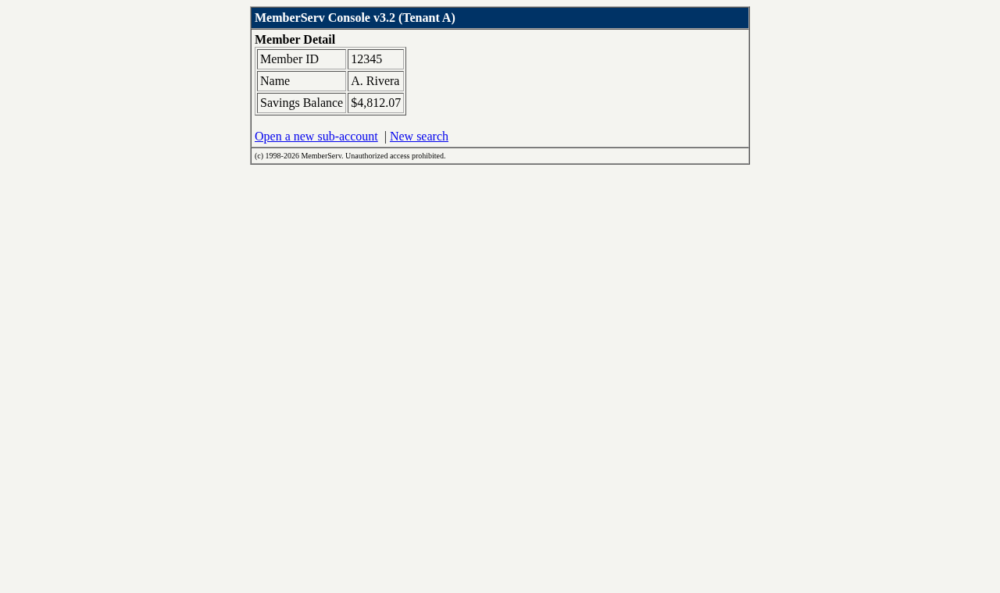

# Computer-use automation (interface.ai take-home, Assignment A)

[](https://github.com/ManyuRV/computer-use-automation/actions/workflows/ci.yml) [](LICENSE)

An LLM drives a web app once to figure out how to do a task, that run gets saved as a
replayable artifact, and replays run with no model involved.

 The target is a local
Flask app built to mimic real legacy bank back-office software: server-rendered,
table layouts, no ids, no test attributes. That's the environment this system is
designed to run against, so that's what I built and tested it against.

## Requirements

- Python 3.10+
- Chrome installed. Playwright drives the system Chrome (`channel="chrome"`), so
  there's no browser download step.

## Setup

```
python3 -m venv .venv && source .venv/bin/activate
pip install -r requirements.txt
```

## Run it

Start the demo app:

```
python3 app/server.py &
```

Replay one of the runs I already recorded. No API key needed for this part:

```
python3 cli.py replay --artifact artifacts/cap-9bff61e6.json --params member_id=12345
python3 cli.py replay --artifact artifacts/cap-02cb1fee.json --params member_id=12345
python3 cli.py replay --artifact artifacts/cap-9bff61e6.json --params member_id=99999   # not-found path
```

Do a fresh discovery run with the model. This needs an OpenAI key, either in
`.secrets/openai_key` (gitignored) or as `OPENAI_API_KEY`:

```
python3 cli.py discover --llm openai \
  --goal "look up member 12345 and read their current savings balance" \
  --member-id 12345
```

That writes a new artifact into `artifacts/` which you can then replay with different
inputs. The two recorded runs cost $0.0078 total on gpt-4o-mini.

## Breaking things on purpose

The demo app has fault switches so you can watch the replay engine deal with them:

```
curl "http://localhost:8377/_control/fault?mode=slow"     # every page takes 6s
curl "http://localhost:8377/_control/fault?mode=expired"  # session expired page
curl "http://localhost:8377/_control/fault?mode="         # back to normal
```

With `slow` on, replay succeeds via its retry backoff. With `expired` on, it fails
cleanly and dumps a screenshot and a11y snapshot into the run's evidence dir.

## Layout

- `cuas/` - the system itself: agent loop, replay engine, artifact schema, guardrails,
  escalation, evidence
- `app/server.py` - the demo target
- `artifacts/` - recorded capabilities (schema `cuas/1.0`)
- `evidence/` - curated successful discovery and risky-action intervention runs
- `REPORT.md` - design writeup. `docs/` has the requirements checklist, ADRs, and the
  validation log

## Notes

- Guardrail policy (allowed hosts, allowed actions, risky-action handling, redaction
  patterns) is plain data in `cuas/guardrails.py`.
- The operator console for human takeover comes up on :8378 only when a run
  escalates.
